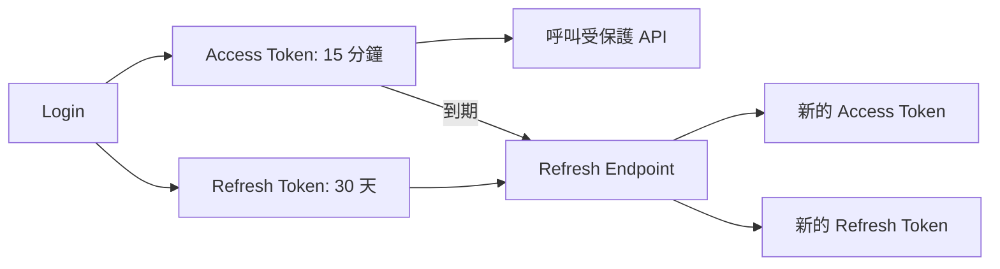
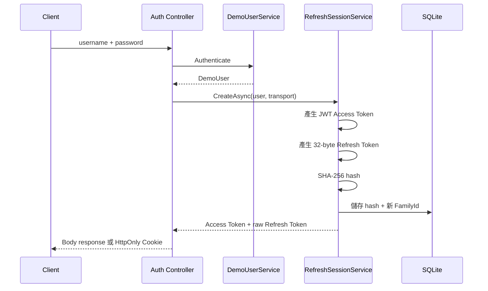
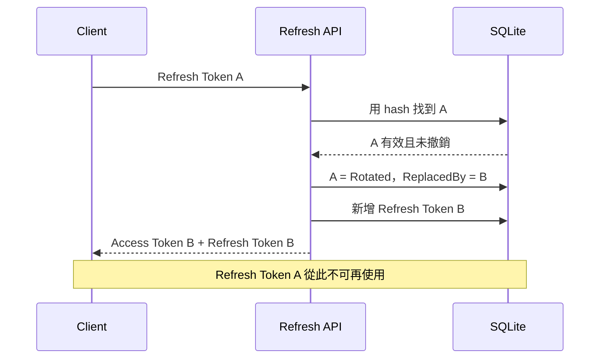
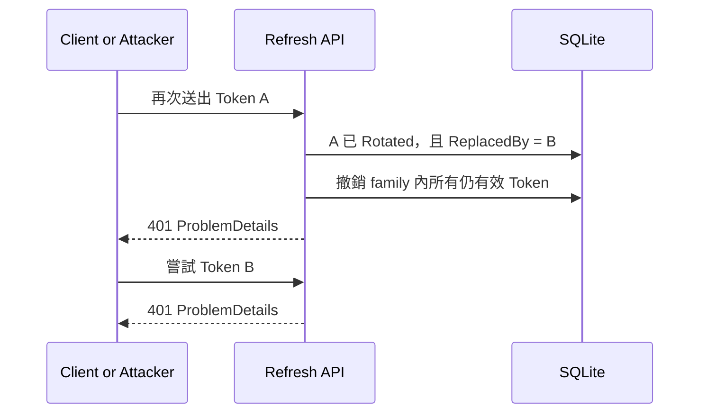
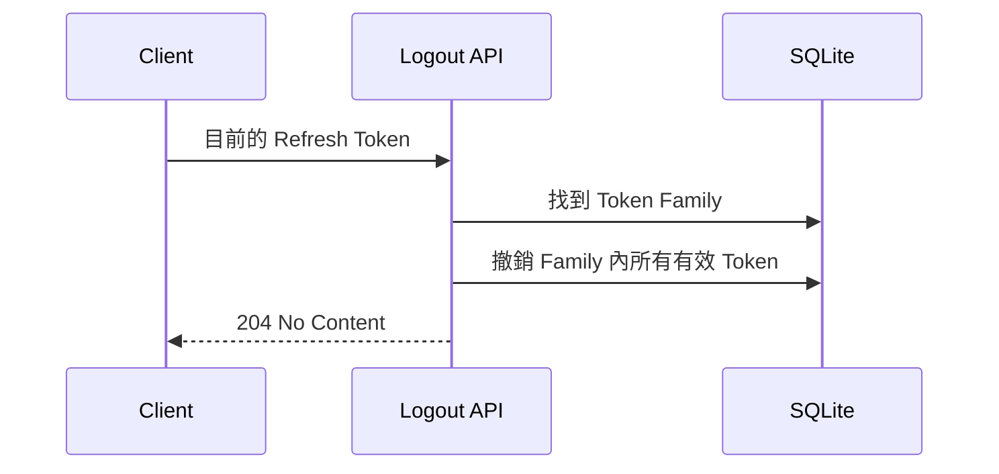

# ASP.NET Core .NET 10 JWT：Refresh Token 進階實作課

> 適用：已完成 JWT 基礎課、熟悉 Controller Web API、DI 與 async/await 的開發者
>
> 建議時間：2.5–3 小時
>
> 先備範例：[`../../basic/`](../../basic/)

> [!WARNING]
> 本課程以固定假帳號、對稱簽章及 SQLite 呈現 Token 生命週期。它能示範安全設計的核心，但不是可直接上線的 Identity Provider。正式系統應優先採用 OIDC/OAuth 與可信任的身分服務。

## 0. 學習目標

完成本課後，學員應能：

- 說明 Access Token 與 Refresh Token 的責任和期限差異。
- 解釋為什麼資料庫只保存 Refresh Token hash。
- 實作一次性 Refresh Token Rotation。
- 偵測舊 Token replay，並撤銷同一 token family。
- 說明 Logout 為何只能撤銷 Refresh Session，不能立即收回既有 JWT。
- 比較 JSON body 與 HttpOnly Cookie 兩種傳輸方式。
- 在 Cookie 模式加入 CSRF 防護。
- 用 Swagger、`.http`、curl 與整合測試驗證完整生命週期。

## 1. 為什麼不能只把 Access Token 設成 30 天

JWT Access Token 是 bearer credential：拿到的人就能使用。若期限過長，外洩後的可利用時間也跟著變長。

Refresh Token 解決的是「Access Token 要短效」和「使用者不應每 15 分鐘重新輸入密碼」之間的衝突：

| 項目 | Access Token | Refresh Token |
|---|---|---|
| 預設期限 | 15 分鐘 | 30 天 |
| 格式 | JWT | 32-byte 安全亂數 |
| 攜帶 Claims | 是 | 否 |
| 呼叫一般 API | 是 | 否 |
| 伺服器保存狀態 | 不保存 | 保存 hash 與生命週期 |
| 可撤銷 | 本範例不可立即撤銷 | 可以 |



## 2. 專案結構與設定

```text
advanced/
├── Controllers/
│   ├── BodyAuthController.cs
│   ├── CookieAuthController.cs
│   └── DemoController.cs
├── Data/
│   ├── AuthDbContext.cs
│   └── AuthDbContextFactory.cs
├── Models/
│   ├── RefreshToken.cs
│   └── RefreshTokenTransport.cs
├── Services/
│   ├── JwtTokenService.cs
│   └── RefreshSessionService.cs
├── Migrations/
├── tests/
└── JwtCourseApi.Advanced.http
```

`appsettings.json`：

```json
{
  "ConnectionStrings": {
    "AuthDatabase": "Data Source=jwt-course-advanced.db;Default Timeout=5"
  },
  "Jwt": {
    "Issuer": "JwtCourseAdvancedApi",
    "Audience": "JwtCourseClient",
    "ExpirationMinutes": 15
  },
  "RefreshToken": {
    "ExpirationDays": 30,
    "CookieName": "__Secure-jwt-refresh"
  }
}
```

Signing Key 不放入設定檔：

```bash
dotnet user-secrets set \
  "Jwt:SigningKey" \
  "dev-only-course-key-please-replace-32-chars-min" \
  --project advanced/JwtCourseApi.Advanced.csproj
```

若要新增或檢查 Migration，先還原專案鎖定的 EF Core 10.0.10 CLI：

```bash
dotnet tool restore --tool-manifest advanced/.config/dotnet-tools.json
```

本專案鎖定 `SQLitePCLRaw.bundle_e_sqlite3 3.0.4`，避免 EF Core 預設解析到包含舊版原生 SQLite 的易受攻擊套件。課程專案也應把 NuGet audit warning 當成必須處理的建置訊號，而不是忽略。

## 3. Refresh Token 資料模型

資料庫不保存原始 Token，只保存 SHA-256 hash：

```text
Client 持有 raw token
        ↓ SHA-256
Server 查詢 token hash
```

`RefreshToken` 主要欄位：

| 欄位 | 用途 |
|---|---|
| `TokenHash` | 原始 Token 的 SHA-256 十六進位字串，並建立 unique index |
| `UserId` | 重新建立 Access Token 時找到使用者 |
| `FamilyId` | 同一次登入及後續所有 Rotation 共用 |
| `Transport` | `Body` 或 `Cookie`，防止跨 endpoint 使用 |
| `CreatedAtUtc` / `ExpiresAtUtc` | 建立與到期時間 |
| `RevokedAtUtc` / `RevokedReason` | Rotation、Replay、Logout 或 Expired |
| `ReplacedByTokenId` | 指向 Rotation 後的新 Token |
| `Version` | 應用程式管理的 optimistic concurrency token |

為什麼要保存 `Transport`？Cookie Token 若也能送到 Body endpoint，就可能避開 Cookie endpoint 的 antiforgery 驗證。信任邊界必須由伺服器強制，而不是只靠前端約定。

SQLite 不提供資料庫自動產生的 `rowversion`，因此每次狀態變更都產生新的 GUID `Version`。此範例還使用程序內 gate，讓單一程序的課堂並行測試可重現；多實例正式系統必須改用集中式資料庫的原子更新或其他分散式協調方式。

## 4. Login：建立新的 Token Family

每次 Login 都是新的 session，因此即使同一位使用者在同一裝置登入兩次，也會得到兩個不同的 `FamilyId`。



亂數 Token 使用 `RandomNumberGenerator.GetBytes(32)`，再做 Base64Url 編碼。不要使用 GUID、時間戳或一般 `Random` 產生安全憑證。

## 5. Rotation：Refresh Token 只能成功一次

Body API：

```http
POST /api/auth/body/refresh
Content-Type: application/json

{
  "refreshToken": "..."
}
```

正常 Rotation：



Rotation 的撤銷舊 Token與新增新 Token在同一個 transaction 中完成。若兩個請求同時使用 Token A，只能有一個取得新 Token。

## 6. Replay Detection 與 Family Revoke

攻擊者與合法使用者若同時持有 Token A，無法可靠判斷誰先 Refresh。因此任何人再次送出已 rotated 的 A，都視為可能重放，整個 family 必須失效。



其他登入產生不同的 `FamilyId`，不會因這次 replay 被登出。這就是 family 比「撤銷該使用者全部 Refresh Token」更精確的地方。

API 對無效、過期、撤銷、重放與模式錯誤都回傳相同的 401：

```json
{
  "status": 401,
  "title": "驗證失敗",
  "detail": "登入資訊或 Refresh Token 無效。"
}
```

不要告訴呼叫者「此 Token 存在但已被 Rotation」，否則會提供額外的 Token 狀態資訊。

## 7. Logout 的真正含義



Logout 後：

- 不能再 Refresh。
- Cookie 模式會刪除 Refresh Token Cookie。
- 已簽發的 JWT Access Token 仍可使用到 15 分鐘到期。

若業務要求「登出後 Access Token 立即失效」，就需要 blacklist、security stamp、reference token 或把驗證交給集中式 Identity Provider；這會犧牲純 stateless 驗證的部分優點。

## 8. Body 模式

路由：

| 方法 | 路由 | 成功 |
|---|---|---|
| POST | `/api/auth/body/login` | 200 Token pair |
| POST | `/api/auth/body/refresh` | 200 新 Token pair |
| POST | `/api/auth/body/logout` | 204 |

成功回應：

```json
{
  "accessToken": "eyJ...",
  "tokenType": "Bearer",
  "accessTokenExpiresAtUtc": "2026-07-27T10:15:00Z",
  "refreshToken": "...",
  "refreshTokenExpiresAtUtc": "2026-08-26T10:00:00Z"
}
```

Body 模式適合 Swagger、CLI、Mobile 或能安全保存 Token 的 client。不要因為方便就預設把長效 Refresh Token 放在瀏覽器 `localStorage`。

## 9. Cookie 模式與 CSRF

Cookie 設定：

```text
HttpOnly = true
Secure = true
SameSite = Strict
Path = /api/auth/cookie
```

`HttpOnly` 降低 JavaScript 直接讀取 Token 的機會，但瀏覽器會自動附帶 Cookie，因此必須考慮 CSRF。

Cookie 流程：

1. `POST /api/auth/cookie/login`。
2. 瀏覽器保存 Refresh Token Cookie 與 antiforgery cookie。
3. response 只回傳 Access Token、期限及 `csrfToken`，不回傳 Refresh Token。
4. 呼叫 Refresh 或 Logout 時，在 `X-CSRF-TOKEN` header 帶上 request token。

```http
POST /api/auth/cookie/refresh
X-CSRF-TOKEN: {csrfToken}
Cookie: __Secure-jwt-refresh=...; __Host-jwt-antiforgery=...
```

如果頁面重新載入而遺失 request token，可呼叫：

```http
GET /api/auth/cookie/csrf
```

此 API 會設定 antiforgery cookie 並回傳新的 request token。缺少或無效的 header 應得到 400；Refresh Token 本身無效則得到 401。

本範例採 `SameSite=Strict`，適合同站課堂情境。跨站 SPA 若需要 `SameSite=None`，還必須明確設計 HTTPS、CORS、credential mode 與 CSRF 策略，不能只改一個 Cookie 選項。

## 10. Swagger、`.http` 與 curl

啟動：

```bash
dotnet run \
  --project advanced/JwtCourseApi.Advanced.csproj \
  --launch-profile advanced-https
```

Swagger：

1. 執行 Body 或 Cookie Login。
2. 把 Access Token貼到右上角 **Authorize**。
3. 呼叫 `/api/demo/profile`。
4. Cookie 模式從 response 複製 `csrfToken` 到 Refresh／Logout 的 `X-CSRF-TOKEN` 欄位。

完整 `.http` 流程在 [`../JwtCourseApi.Advanced.http`](../JwtCourseApi.Advanced.http)。

Body curl：

```bash
curl -k -X POST https://localhost:7223/api/auth/body/login \
  -H 'Content-Type: application/json' \
  -d '{"username":"student","password":"Student123!"}'
```

Cookie curl 使用 cookie jar：

```bash
curl -k -c cookies.txt \
  -X POST https://localhost:7223/api/auth/cookie/login \
  -H 'Content-Type: application/json' \
  -d '{"username":"student","password":"Student123!"}'

CSRF_TOKEN='貼上 response 的 csrfToken'

curl -k -b cookies.txt -c cookies.txt \
  -X POST https://localhost:7223/api/auth/cookie/refresh \
  -H "X-CSRF-TOKEN: $CSRF_TOKEN"
```

不要提交 `cookies.txt`；它已列入 `.gitignore`。

## 11. 400、401 與 403

| 狀態 | 意義 | 本課程例子 |
|---|---|---|
| 400 Bad Request | 請求格式或 antiforgery 驗證失敗 | 缺少 `X-CSRF-TOKEN` |
| 401 Unauthorized | 身份憑證不可接受 | Refresh Token 無效、過期、撤銷、重放或模式錯誤 |
| 403 Forbidden | 已驗證，但權限不足 | Student 呼叫 Admin API |

Refresh 失敗時不要把所有錯誤都誤判成 403；Refresh Token 是身份憑證，不是角色授權規則。

## 12. Lab 驗收

- [ ] Body Login 回傳 Access Token 與 Refresh Token。
- [ ] Access Token 可呼叫 `/api/demo/profile`。
- [ ] Refresh Token A 成功換得 Token B。
- [ ] 再次使用 A 得到 401。
- [ ] Replay A 後，B 也得到 401。
- [ ] 另一個 Login family 仍可 Refresh。
- [ ] Logout 後 Refresh 得到 401。
- [ ] 將測試時鐘推進 31 天後，Refresh 得到 401。
- [ ] 資料庫只有 64 字元 SHA-256 hash，沒有原始 Token。
- [ ] Cookie response 沒有 `refreshToken` 欄位。
- [ ] Refresh Cookie 具有 HttpOnly、Secure、SameSite=Strict 與限制 Path。
- [ ] Cookie Refresh 缺少 CSRF header 得到 400。
- [ ] Body Token 送到 Cookie endpoint 得到 401。
- [ ] 兩個並行 Refresh 只有一個先成功，隨後 family 因 replay 失效。

自動驗證：

```bash
dotnet test advanced/tests/JwtCourseApi.Advanced.Tests/JwtCourseApi.Advanced.Tests.csproj
```

## 13. 課堂測驗

1. 為什麼 Access Token 通常比 Refresh Token 短效？
2. Refresh Token 是否必須是 JWT？
3. 為什麼資料庫不保存原始 Refresh Token？
4. Rotation 後舊 Token應處於什麼狀態？
5. 為什麼 replay 時要撤銷整個 family？
6. 不同裝置是否應共用同一個 family？
7. Logout 能否立即讓既有 JWT 失效？
8. HttpOnly 能否單獨解決 CSRF？
9. Cookie Token 為什麼不能在 Body endpoint 使用？
10. 並行 Refresh 為什麼需要 concurrency control？

### 參考答案

1. 限縮外洩後可被濫用的時間。
2. 不必；本課使用不可預測的 opaque random token。
3. 資料庫外洩時，攻擊者不能直接拿儲存值呼叫 Refresh API。
4. 標記為 Rotated，記錄撤銷時間與 replacement。
5. 重放表示 family 中的新 Token 也可能已落入攻擊者手中。
6. 不應；每次 Login 建立獨立 family，才能只撤銷受影響 session。
7. 不能，本範例只撤銷 Refresh Session。
8. 不能；Cookie 會自動附帶，仍需 SameSite 與 antiforgery 策略。
9. 否則可避開 Cookie endpoint 的 CSRF 邊界。
10. 防止同一個一次性 Token 同時換出多組有效 Token。

## 14. 正式環境檢查

- 使用 OIDC/OAuth 與專用 Identity Provider。
- 使用 Key Vault／Secret Manager、非對稱金鑰與金鑰輪替。
- 使用集中式持久化，讓所有執行個體看到相同的 Token 狀態。
- 以資料庫原子更新、transaction 或可靠的分散式機制處理並行 Rotation。
- 不在 log、APM、exception 或 analytics 中記錄原始 Token。
- 對 Login、Refresh 加入 Rate limiting、稽核與異常偵測。
- 定期清理到期與已撤銷紀錄，但保留符合稽核需求的資料。
- 依 client 類型分別設計 Cookie、Mobile 或 backend-to-backend 的 Token 儲存策略。
- Migration 應由部署流程執行，不由每個正式應用程式實例在啟動時競爭執行。

## 課程總結

```text
Login
  ↓
Access Token + Refresh Token Family
  ↓
Access Token 到期
  ↓
Refresh Token Rotation
  ↓
舊 Token 單次使用後失效
  ↓
Replay → Family Revoke
  ↓
Logout → Family Revoke
```

Refresh Token 讓系統從純 Stateless JWT 進入「Access Token 無狀態、Refresh Session 有狀態」的混合設計。真正的進階重點不是多一個 Token，而是正確管理一次性使用、持久化、並行、撤銷、傳輸邊界與攻擊後的復原範圍。
