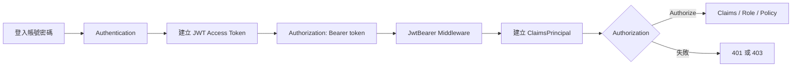
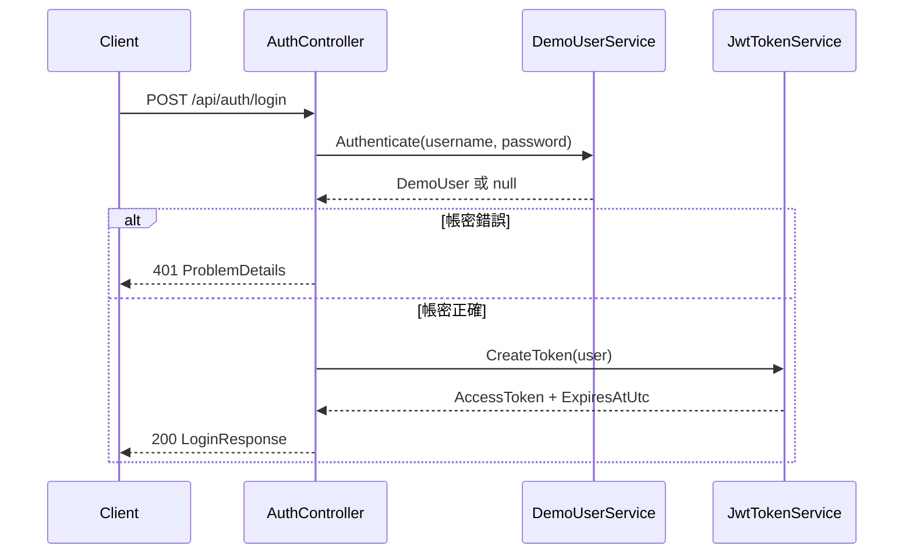

# ASP.NET Core .NET 10 JWT 驗證與授權：基礎實作課

> 適用：熟悉 C#、Controller Web API 與依賴注入的開發者
>
> 建議時間：3–4 小時
>
> 本課程不實作 Refresh Token；最後一節會說明進階課需要補上的元件。

> [!WARNING]
> 本課程用固定假帳號與 API 直接簽發 JWT，是為了讓 Authentication、Claims、Role 與 Policy 的流程容易觀察。Microsoft 官方建議正式 API 使用 OIDC/OAuth 與可信任的 Token Service；不要把本範例的登入端點直接部署到正式環境。

## 0. 課程地圖



完成本課後，學員應能：

- 說明 Authentication 和 Authorization 的差異。
- 讀懂 JWT 的 Header、Payload、Signature 與常見 Claims。
- 在 .NET 10 Controller API 中設定 JWT Bearer 驗證。
- 使用 `[Authorize]`、Role 和 Policy 保護 API。
- 從 `HttpContext.User` 讀取目前使用者資料。
- 用 Swagger UI、`.http` 和 curl 驗證 200、401、403。
- 說明本範例為何不能直接當成正式登入系統。

## 1. Authentication 與 Authorization

Authentication（驗證）回答：「你是誰？」

Authorization（授權）回答：「你可以做什麼？」

一次 API 呼叫的概念流程是：

1. 使用者先登入，伺服器驗證帳密。
2. 伺服器簽發短效 Access Token。
3. 用戶端在每次 API request 加上 `Authorization: Bearer {token}`。
4. `JwtBearerHandler` 驗證 Token，建立 `ClaimsPrincipal`。
5. `[Authorize]`、Role 或 Policy 判斷是否允許執行 action。

Cookie、Session、Token 並不是同一件事：Cookie 是瀏覽器傳送資料的機制，Session 通常代表伺服器端保存狀態，Token 則是可攜帶的認證憑證。JWT API 常見的設計是短效、無伺服器 Session 的 Stateless access token；這不代表所有登入資料都不需要伺服器端儲存。

## 2. JWT 核心

JWT 通常長成三段：

```text
xxxxx.yyyyy.zzzzz
Header.Payload.Signature
```

- Header：演算法與 Token 類型，例如 `HS256`、`JWT`。
- Payload：Claims，例如 `sub`、`name`、`role`、`exp`。
- Signature：用簽章金鑰驗證內容沒有被竄改。

Payload 只是 Base64Url 編碼，不是加密。任何拿到 Token 的人都可能解碼 Payload，因此不要放密碼、信用卡、私密個資或 Refresh Token。HTTPS、短效期限、可信任的簽發者和安全金鑰仍然必要。

本範例使用的 Claims：

| Claim | 用途 |
|---|---|
| `iss` | Issuer，誰簽發 Token |
| `aud` | Audience，Token 要給哪個 API |
| `sub` | 使用者唯一識別碼 |
| `name` | 顯示名稱 |
| `preferred_username` | 登入帳號 |
| `role` | Role authorization 使用的角色 |
| `department` | Policy authorization 使用的部門 |
| `exp` | 到期時間 |
| `iat` | 簽發時間 |
| `jti` | 此 Token 的唯一識別碼 |

## 3. 專案結構

```text
JwtCourseApi/
├── Controllers/
│   ├── AuthController.cs
│   └── DemoController.cs
├── DTOs/
│   ├── LoginRequest.cs
│   └── LoginResponse.cs
├── Filters/
│   └── AuthorizeOperationFilter.cs
├── Models/
│   └── DemoUser.cs
├── Options/
│   └── JwtOptions.cs
├── Services/
│   ├── DemoUserService.cs
│   ├── IDemoUserService.cs
│   ├── IJwtTokenService.cs
│   └── JwtTokenService.cs
├── JwtCourseApi.Basic.http
├── Program.cs
└── appsettings.json
```

`JwtOptions` 負責設定，`JwtTokenService` 負責簽發 Token，`DemoUserService` 只負責比對教學用帳號，Controller 負責 HTTP 邊界。密碼不會進入 Claims 或 API response。

## 4. 環境準備與 User Secrets

確認 SDK：

```bash
dotnet --version
```

設定 HTTPS 開發憑證：

```bash
dotnet dev-certs https --trust
```

`appsettings.json` 只包含不敏感設定：

```json
{
  "Jwt": {
    "Issuer": "JwtCourseApi",
    "Audience": "JwtCourseClient",
    "ExpirationMinutes": 15
  }
}
```

SigningKey 使用 User Secrets：

```bash
dotnet user-secrets set \
  "Jwt:SigningKey" \
  "dev-only-course-key-please-replace-32-chars-min" \
  --project JwtCourseApi.Basic.csproj
```

啟動時 `JwtOptions` 會驗證 Issuer、Audience、SigningKey 和期限。缺少金鑰時，應在啟動階段失敗，而不是等到第一次登入才出錯。

## 5. 設定 JwtBearer Authentication

`Program.cs` 的設定包含四個重要驗證：

```csharp
builder.Services.AddAuthentication(JwtBearerDefaults.AuthenticationScheme)
    .AddJwtBearer(options =>
    {
        options.MapInboundClaims = false;
        options.TokenValidationParameters = new TokenValidationParameters
        {
            ValidateIssuer = true,
            ValidIssuer = jwtOptions.Issuer,
            ValidateAudience = true,
            ValidAudience = jwtOptions.Audience,
            ValidateIssuerSigningKey = true,
            IssuerSigningKey = signingKey,
            ValidateLifetime = true,
            ClockSkew = TimeSpan.Zero,
            NameClaimType = "name",
            RoleClaimType = "role"
        };
    });
```

觀察重點：

- 只驗證 Signature 而不驗證 Issuer、Audience、Lifetime 會放寬信任邊界。
- `ClockSkew=0` 讓課堂上的到期測試容易觀察；正式環境應依系統時鐘同步策略決定。
- `MapInboundClaims=false` 搭配明確的 `NameClaimType`、`RoleClaimType`，讓 JWT claim 名稱和程式碼一致。

## 6. Token Service 與登入 API

登入流程：



成功回應：

```json
{
  "accessToken": "eyJ...",
  "tokenType": "Bearer",
  "expiresAtUtc": "2026-07-27T10:15:00Z"
}
```

失敗回應是 401，代表「沒有取得可接受的身份憑證」。不要把密碼或完整 Token 寫入 log。

## 7. Authorization：Authorize、Claims、Role、Policy

### `[Authorize]`

`GET /api/demo/profile` 只允許已驗證的使用者：

```csharp
[HttpGet("profile")]
[Authorize]
public IActionResult Profile() { ... }
```

Controller 透過 `User.Claims`、`FindFirstValue("sub")` 等 API 讀取 JWT 建立的身份資料。

### Role

`GET /api/demo/admin` 使用：

```csharp
[Authorize(Roles = "Admin")]
```

Student 已經登入，但沒有 Admin role，因此是 403，而不是 401。

### Policy

`Program.cs` 註冊：

```csharp
builder.Services.AddAuthorizationBuilder()
    .AddPolicy("ItDepartmentOnly", policy =>
        policy.RequireClaim("department", "IT"));
```

Endpoint 套用：

```csharp
[Authorize(Policy = "ItDepartmentOnly")]
```

本範例中 Student 的 `department=IT`，因此 Policy 成功；Admin 的 `department=Management`，因此得到 403。

### Middleware 順序

```csharp
app.UseAuthentication();
app.UseAuthorization();
app.MapControllers();
```

Authentication 必須先建立 `HttpContext.User`，Authorization 才能判斷角色、Claims 和 Policy。`MapControllers` 應放在兩者之後，讓 endpoint 執行前已完成授權。

## 8. Swagger UI、`.http` 與 curl

啟動：

```bash
dotnet run --launch-profile basic-https
```

開啟 <https://localhost:7123/swagger>：

1. 執行 `POST /api/auth/login`。
2. 複製回應的 `accessToken`。
3. 點右上角 **Authorize**，貼上完整 Token（UI 會自動處理 Bearer 前綴）。
4. 呼叫 `profile`、`admin`、`it-department`，觀察 200/403。

### curl：登入

```bash
curl -k -X POST https://localhost:7123/api/auth/login \
  -H 'Content-Type: application/json' \
  -d '{"username":"student","password":"Student123!"}'
```

把回應中的 Token 放入 shell 變數：

```bash
TOKEN='貼上 accessToken'
```

### curl：呼叫 API

```bash
curl -k https://localhost:7123/api/demo/profile \
  -H "Authorization: Bearer $TOKEN"

curl -k -i https://localhost:7123/api/demo/admin \
  -H "Authorization: Bearer $TOKEN"

curl -k -i https://localhost:7123/api/demo/it-department \
  -H "Authorization: Bearer $TOKEN"
```

完整順序也放在 [`JwtCourseApi.Basic.http`](../JwtCourseApi.Basic.http)。

## 9. 401 與 403

| 狀態 | 意義 | 本課程例子 |
|---|---|---|
| 401 Unauthorized | 沒有可接受的身份憑證 | 沒帶 Token、Token 過期、Signature 錯、Issuer/Audience 錯 |
| 403 Forbidden | 已驗證，但不符合授權規則 | Student 呼叫 Admin API、Management 呼叫 IT Policy API |

快速除錯順序：

1. 檢查 request 是否真的有 `Authorization` header。
2. 檢查格式是否為 `Bearer`、一個空格、完整 Token。
3. 解碼 Token，確認 `iss`、`aud`、`exp`、`role`、`department`。
4. 比對 `appsettings.json` 和 Token Service 的 Issuer/Audience。
5. 確認 SigningKey 完全相同且至少 32 字元。
6. 確認 `UseAuthentication()` 在 `UseAuthorization()` 前面。
7. 若是 403，檢查 Role 名稱大小寫及 Policy 所要求的 Claim。

### 到期測試

把 User Secrets 暫時改成 1 分鐘：

```bash
dotnet user-secrets set "Jwt:ExpirationMinutes" "1" --project JwtCourseApi.Basic.csproj
```

重新啟動、登入、等待過期後呼叫受保護 API，應得到 401。測試後移除覆寫，回到 `appsettings.json` 的 15 分鐘：

```bash
dotnet user-secrets remove "Jwt:ExpirationMinutes" --project JwtCourseApi.Basic.csproj
```

## 10. Lab 驗收

請學員完成下列清單：

- [ ] 未登入可呼叫 `/api/demo/public`。
- [ ] 錯誤帳密登入得到 401。
- [ ] Student 登入得到 `accessToken`。
- [ ] 帶 Student Token 呼叫 `/api/demo/profile` 得到 200。
- [ ] 帶 Student Token 呼叫 `/api/demo/admin` 得到 403。
- [ ] 帶 Student Token 呼叫 `/api/demo/it-department` 得到 200。
- [ ] Admin 登入並呼叫 `/api/demo/admin` 得到 200。
- [ ] 帶 Admin Token 呼叫 `/api/demo/it-department` 得到 403。
- [ ] 竄改 Token 的任一段後得到 401。
- [ ] 在 Swagger UI 用 Authorize 成功呼叫受保護 API。

### Challenge

新增 `Teacher` 使用者與 `TeacherOnly` Policy，要求只有 `department=Education` 且角色為 `Teacher` 的 Token 可以存取。完成後說明：這項規則應該用 Role、Claim、Policy，還是三者組合，並解釋原因。

## 11. 課堂測驗

1. Authentication 和 Authorization 的差異是什麼？
2. JWT 的三段分別是什麼？
3. Payload 被 Base64Url 編碼是否等於加密？
4. 為什麼不能把密碼放入 JWT？
5. `iss` 和 `aud` 的用途是什麼？
6. 沒帶 Token 通常得到 401 還是 403？
7. 已登入但沒有 Admin role 通常得到 401 還是 403？
8. `UseAuthentication` 和 `UseAuthorization` 的順序為何？
9. `[Authorize(Roles = "Admin")]` 檢查的是哪一類資料？
10. Policy 比單一 Role 多提供了什麼能力？
11. 為什麼本範例的固定帳號不能直接上線？
12. Access Token 為什麼通常設定短效？

### 參考答案

1. Authentication 確認身份；Authorization 判斷權限。
2. Header、Payload、Signature。
3. 不是，任何拿到 Token 的人都可解碼 Payload。
4. Payload 可被讀取，且 JWT 不應承載秘密。
5. 限定簽發者與目標 API，避免接受錯誤來源的 Token。
6. 401。
7. 403。
8. 先 Authentication，再 Authorization，最後才執行 Controller endpoint。
9. `role` Claim。
10. 可用 Claims、requirements 和 handler 組合可重用的授權規則。
11. 沒有真正的帳號儲存、密碼雜湊、登入防護和可信任 Token Service。
12. 降低 Token 遺失或外洩後可被濫用的時間；正式系統再搭配 Refresh Token 或標準 OAuth 流程。

## 12. 正式環境與進階課

正式環境應考慮：

- 使用 OIDC/OAuth 與專用 Identity Provider，不由 API 自己處理完整登入流程。
- 使用非對稱金鑰、Key Vault/Secret Manager、金鑰輪替與最小權限。
- 使用 HTTPS、短效 Access Token、稽核 log、Rate limiting 與安全的前端儲存策略。
- 不在 log、瀏覽器 localStorage 或錯誤訊息中暴露敏感 Token。
- 多實例環境使用可持久化、集中管理的 Token/Session 狀態。

若要進入 Refresh Token 實作課，還需要加入 RefreshToken entity、持久化儲存、Refresh API、Rotation、Revoke、Logout、重放攻擊處理與整合測試；那應該作為另一個進階 Lab，而不是把基礎課的記憶體假資料直接延伸成正式認證系統。

## 課程總結

```text
Login
  ↓
Authentication
  ↓
JWT Bearer
  ↓
ClaimsPrincipal
  ↓
Authorize
  ↓
Claims / Role / Policy
  ↓
200、401 或 403
```

這個範例的重點不是「自己寫一個完整登入系統」，而是讓學員看懂 ASP.NET Core 如何驗證 Bearer Token、建立 User，以及在 Controller 上執行授權規則。
